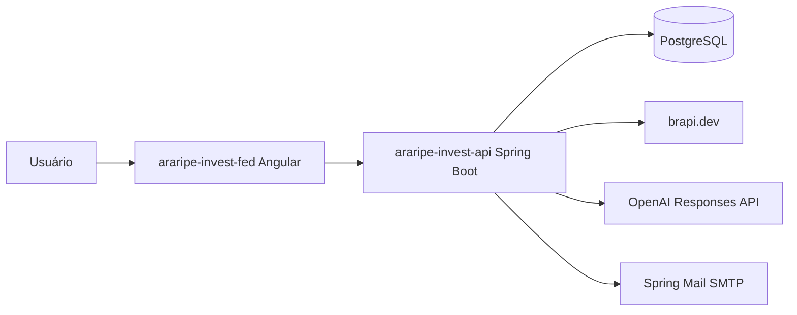
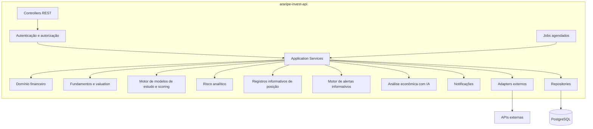
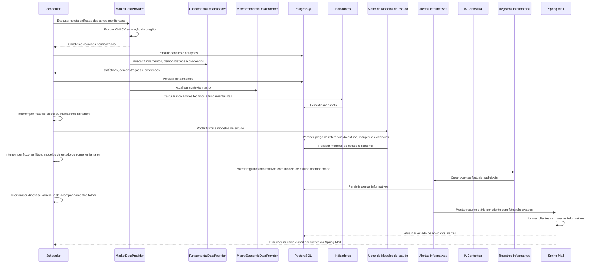

# Arquitetura e integrações

## Visão macro

O Araripe Invest será dividido em dois projetos:

- `araripe-invest-api`: backend responsável por dados, fundamentos, regras, alertas informativos, IA, e-mails e APIs.
- `araripe-invest-fed`: frontend responsável por visualização, filtros, registros informativos de posição, associação de modelo de estudo acompanhado, alertas informativos, explicações e histórico.

Cada projeto deve ficar em um repositório Git separado, com CI/CD independente.

| Repositório          | Responsabilidade                                                           | Pipeline                                                             |
| -------------------- | -------------------------------------------------------------------------- | -------------------------------------------------------------------- |
| `araripe-invest-api` | Backend, banco, jobs, regras, integrações, fundamentos, IA, e-mails e APIs | Build Java, testes, análise, imagem Docker e deploy da API.          |
| `araripe-invest-fed` | Frontend Angular e experiência web                                         | Build Angular, testes, análise, empacotamento estático e deploy web. |

## Perfis de acesso

| Perfil     | Acesso                                                                                                                     |
| ---------- | -------------------------------------------------------------------------------------------------------------------------- |
| `CUSTOMER` | Dashboards, screener, detalhes das modelos de estudo, registros informativos de posição, alertas informativos e histórico. |
| `ADMIN`    | Tudo que o assinante acessa, mais cadastro de usuários, configurações gerais e cadastro dos ativos do universo monitorado. |

## Arquitetura do backend

## Fluxo de processamento diário

Etapas dependentes não devem rodar após falha crítica. Essa decisão evita gerar screener, alertas informativos ou e-mails com dados antigos, modelos de estudo incompletas ou indicadores não recalculados para a `referenceDate`.

## Integrações planejadas

| Integração           | Fase | Uso                                                                                                                                                 |
| -------------------- | ---: | --------------------------------------------------------------------------------------------------------------------------------------------------- |
| brapi.dev            |  MVP | Cotações, OHLCV, dividendos, perfil, estatísticas, dados financeiros, balanço, DRE, fluxo de caixa e macro.                                         |
| OpenAI Responses API |  MVP | Análise econômica de modelo de estudo com busca web obrigatória, fontes auditáveis, saída estruturada e validação.                                  |
| Spring Mail / SMTP   |  MVP | Envio de um único e-mail diário consolidado por cliente, somente quando houver alertas informativos, usando servidor SMTP configurado por ambiente. |

## Princípio de isolamento

Toda fonte externa deve ficar atrás de uma interface de domínio. Exemplo:

- `MarketDataProvider`
- `MacroEconomicDataProvider`
- `FundamentalDataProvider`
- `EconomicContextAiProvider`
- `NotificationProvider`

Isso evita que o domínio financeiro dependa diretamente de brapi.dev, OpenAI, Spring Mail, SMTP ou qualquer API específica.

## Idempotência

Jobs devem poder rodar mais de uma vez sem duplicar registros. Chaves naturais indicadas:

- candle: ativo + data do pregão + fonte;
- indicador: ativo + data do pregão + versão do cálculo;
- fundamento: ativo + data/período + fonte + versão;
- demonstração financeira: ativo + tipo + período + fonte;
- dividendo: ativo + tipo + data base + data pagamento + fonte;
- modelo de estudo: ativo + data + tipo de modelo de estudo + versão da regra;
- posição do cliente: usuário + ativo + status aberta/fechada + data de referência;
- associação modelo de estudo-posição: usuário + posição + tipo de modelo de estudo + status ativa;
- análise IA: modelo de estudo + ativo + data de referência + versão do prompt + modelo + hash do pacote de entrada;
- alerta informativo: usuário + posição + data + tipo de alerta informativo + versão da regra + análise IA usada, quando houver;
- lote de notificação: usuário + data de referência + canal + versão da regra;
- item de notificação: lote + posição + alerta informativo + tipo de evento.

## Uso de IA generativa

A integração com OpenAI deve ser feita por adapter próprio da OpenAI Responses API. A análise econômica de modelo de estudo exige que a IA consulte notícias e fontes econômicas atuais na web usando a ferramenta hospedada `web_search` de forma obrigatória.
O adapter deve configurar `reasoning.effort` de forma explícita, com padrão mínimo `medium` para o modelo usado na análise macro/setorial, e registrar a versão do prompt sempre que as regras de checagem factual mudarem.

O processamento deve ser exposto como recurso de API:

- listagem de análises econômicas de IA persistidas, com filtros por modelo de estudo, ativo, data, status e modelo;
- detalhe/status de uma análise específica, incluindo fontes, validação, erro e latência;
- solicitação administrativa de nova análise recebendo `thesisId`, montando o pacote de dados no backend e persistindo o resultado.

Regras:

- o prompt deve receber apenas dados necessários para a análise;
- o prompt de enriquecimento econômico deve exigir análise macro/setorial baseada em busca web real;
- o pacote enviado à IA deve ser montado pelo backend a partir da modelo de estudo, ativo, score, fundamentos, valuation, risco, último snapshot persistido por indicador macro e alerta informativo determinística relacionada quando houver;
- a IA não pode inferir Selic, IPCA, CDI, câmbio ou outros indicadores macro por memória; qualquer número macro citado deve vir do pacote interno ou de fonte externa auditável;
- a resposta deve ser estruturada e validada antes de persistir;
- a IA deve citar ou referenciar fontes configuradas pelo sistema e URLs externas efetivamente consultadas;
- resposta sem URL externa de fonte/notícia econômica deve ser invalidada e não pode enriquecer alerta informativo;
- falha, timeout ou resposta inválida da IA devem manter o fluxo determinístico funcionando;
- IA não pode aprovar alerta informativo bloqueada por filtro financeiro;
- a execução deve registrar usuário solicitante, data/hora, prompt, modelo, latência, status de validação e erro quando houver;
- no MVP, a solicitação de nova análise deve exigir perfil `ADMIN`; clientes podem consultar análises validadas expostas nas telas.
