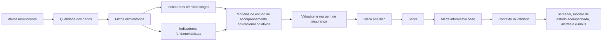

# Motor de regras, modelos de estudo e scoring

## Estratégia

O motor inicial deve ter decisão financeira determinística. Cada decisão precisa ser explicável por regras, fundamentos e dados. A IA generativa pode enriquecer contexto econômico, levantar riscos qualitativos e melhorar a explicação, mas não decide sozinha e não pode contrariar filtros obrigatórios.

O fluxo é:



## Filtros eliminatórios

| Filtro              | Regra inicial                                                                                   |
| ------------------- | ----------------------------------------------------------------------------------------------- |
| Liquidez            | Volume financeiro médio de 60 dias >= R$ 5 milhões.                                             |
| Preço mínimo        | Fechamento >= R$ 2,00.                                                                          |
| Dados               | Bloquear dados incompletos, atrasados ou inconsistentes.                                        |
| Fundamentos mínimos | Bloquear ativo sem dados de lucro, receita, caixa ou balanço suficientes.                       |
| Lucratividade       | Bloquear prejuízo recorrente, salvo modelo de estudo futura específica de turnaround.                       |
| Caixa               | Bloquear fluxo de caixa livre persistentemente negativo sem justificativa.                      |
| Endividamento       | Bloquear dívida elevada sem capacidade de geração de caixa.                                     |
| Deterioração        | Registrar separadamente queda forte de receita, queda forte de lucro e margem líquida negativa. |
| Valuation           | Bloquear múltiplos extremos sem crescimento que justifique.                                     |
| Tendência longa     | Evitar ativo em deterioração técnica persistente.                                               |
| Contexto macro      | Penalizar setores sensíveis a juros, inflação ou câmbio quando o contexto estiver desfavorável. |

### Dados fundamentalistas desatualizados

O filtro de dados deve avaliar a idade do período contábil usado como evidência, não apenas a data em que o snapshot derivado foi processado.

Regras:

- `reference_date` do snapshot derivado representa processamento, não necessariamente atualização do balanço;
- `most_recent_quarter` representa o período contábil usado na análise e deve ser a base de frescor;
- o sistema deve inferir o calendário fiscal pelo último demonstrativo anual válido disponível;
- para trimestres, o próximo período esperado vence 45 dias após o encerramento do trimestre, com 15 dias adicionais de tolerância operacional;
- para fechamento anual, o próximo período esperado vence 3 meses após o encerramento do exercício social, com 15 dias adicionais de tolerância operacional;
- após esse prazo, o ativo recebe `DATA_QUALITY_BLOCKED` e não pode gerar alerta informativo.

Essa regra evita que um ativo pareça atualizado só porque o job recalculou hoje indicadores derivados de um demonstrativo antigo.

### Relação entre filtros e score

Filtro eliminatório não deve ser tratado sempre como sinônimo de score zero. O sistema deve separar:

- `score`: nota diagnóstica da qualidade da modelo de estudo, quando os dados são suficientes;
- `elegibilidade`: permissão para publicar modelo de estudo ou alerta informativo com base auditável;
- `failedFilters`: motivos auditáveis que bloqueiam o estudo ou o alerta.

O screening de ativos não possui status próprio. Seu papel é registrar `failedFilters` e evidências por ativo, data e versão de regra. A classificação educacional deve ocorrer somente na geração do modelo de estudo, por meio de status neutros em `ThesisStatus`.

Quando houver dados suficientes, filtros como liquidez insuficiente, preço abaixo do mínimo, endividamento extremo, valuation extremo, deterioração de tendência, queda forte de lucro ou volatilidade extrema devem bloquear modelo de estudo publicado ou alerta informativo sem base, mas o score diagnóstico pode continuar sendo calculado e persistido. Isso permite explicar casos como "empresa com boa qualidade, mas sem liquidez suficiente".

### Relação entre filtros e status da modelo de estudo

O status da modelo de estudo não deve tratar todo `failedFilters` como reprovação total. A classificação inicial é:

| Grupo de filtro                    | Exemplos                                                                                                                                            | Status esperado                                                        |
| ---------------------------------- | --------------------------------------------------------------------------------------------------------------------------------------------------- | ---------------------------------------------------------------------- |
| Invalidação estrutural             | Prejuízo recorrente, caixa livre persistentemente negativo, queda forte de receita, margem líquida negativa, tendência longa claramente deteriorada | `CRITERIOS_EM_ATENCAO`                                                        |
| Risco de exposição                 | Endividamento excessivo, valuation extremo sem crescimento, queda forte de lucro isolada, volatilidade extrema                                      | `CRITERIOS_EM_ATENCAO`                                                   |
| Dados ou fundamentos insuficientes | `DATA_QUALITY_BLOCKED`, `MINIMUM_FUNDAMENTALS_MISSING`                                                                                              | `DADOS_DESATUALIZADOS` ou `DADOS_INSUFICIENTES`, conforme o bloqueio   |
| Bloqueio de entrada                | Liquidez insuficiente ou preço abaixo do mínimo                                                                                                     | `EM_ESTUDO` se o score diagnóstico for >= 60; caso contrário `CRITERIOS_PARCIALMENTE_ATENDIDOS` |

Mesmo quando um filtro permite acompanhamento educacional, o sistema não deve transformar o resultado em quantidade, aporte, alocação individualizada ou instrução. O screener pode mostrar um modelo de estudo para acompanhamento, desde que os bloqueios fiquem explícitos.

Filtros não classificados explicitamente não devem virar `CRITERIOS_EM_ATENCAO` por fallback genérico. Eles devem permanecer auditados em `failedFilters`, enquanto a decisão normal de status avalia obrigatoriedade da modelo de estudo, valuation, preço de referência do estudo, margem de segurança e score. Quando um novo filtro passar a ter efeito bloqueante, ele deve ser incluído explicitamente em um dos grupos acima e coberto por teste.

### Deterioração fundamental

A deterioração fundamental deve ser auditável por dimensão, e não registrada apenas como mensagem genérica.

Regras iniciais:

- queda de receita igual ou inferior a -15% em qualquer janela disponível bloqueia modelo de estudo nova e tende a invalidar a modelo de estudo;
- queda de lucro igual ou inferior a -20% em qualquer janela disponível bloqueia modelo de estudo sem ressalva e pode gerar alerta informativo factual, mas não deve virar orientação de saída, redução ou manutenção;
- margem líquida igual ou inferior a -5% indica perda operacional relevante e tende a invalidar a modelo de estudo;
- margem positiva não prova estabilidade; compressão de margem exige comparação histórica quando esses dados estiverem disponíveis.
- crescimento trimestral usado em filtro eliminatório deve comparar o mesmo trimestre do ano anterior. Comparação trimestre contra trimestre imediatamente anterior pode ser sazonal e não deve acionar deterioração forte de receita sozinha.
- crescimento percentual só deve ser calculado sobre base anterior positiva. Bases negativas ou zero precisam de tratamento próprio para evitar sinal invertido e falso crescimento.

Tratamento de base negativa:

| Situação                         | Tratamento                                                                               |
| -------------------------------- | ---------------------------------------------------------------------------------------- |
| lucro positivo para lucro maior  | Calcular percentual tradicional.                                                         |
| lucro positivo para lucro menor  | Calcular percentual tradicional, podendo acionar queda forte.                             |
| lucro positivo para prejuízo     | Calcular queda forte, normalmente deterioração relevante.                                 |
| prejuízo para lucro              | Registrar melhora qualitativa, mas não contar como crescimento percentual normal.         |
| prejuízo menor que antes         | Registrar melhora qualitativa, mas ainda exigir lucro/margem positivos para aprovar modelo de estudo. |
| prejuízo maior que antes         | Registrar deterioração proporcional sobre o módulo do prejuízo anterior.                  |
| base zero                        | Evitar crescimento percentual; se o valor atual ficou negativo, tratar como deterioração. |

### Caixa livre persistente

Fluxo de caixa livre persistentemente negativo exige evidência em períodos contábeis distintos. O sistema não deve contar snapshots diários repetidos do mesmo balanço como recorrência.

Regras:

- usar demonstrativos `CASH_FLOW` anuais válidos quando disponíveis;
- contar no máximo os últimos quatro períodos anuais;
- se houver dois ou mais períodos contábeis distintos com FCF negativo, acionar `PERSISTENT_NEGATIVE_FREE_CASHFLOW`;
- se o FCF atual for negativo e o caixa operacional for não positivo, acionar o mesmo filtro mesmo sem histórico suficiente;
- quando usar fallback em snapshots fundamentalistas, deduplicar por `most_recent_quarter` antes de contar períodos negativos.

Exemplo:

```text
receita: +1,58%
receita anual: +3,68%
lucro: -54,29%
lucro anual: -56,27%
margem líquida: +6,44%
```

Neste caso, a classificação correta é queda forte de lucro. O sistema pode emitir alerta informativo de premissa alterada, mas não deve afirmar deterioração forte de receita ou margem nem sugerir conduta sem outros gatilhos auditáveis.

## Modelo de estudo 1 - Qualidade fundamentalista com preço razoável

Objetivo: encontrar empresas sólidas, rentáveis e negociando em preço aceitável.

Condições sugeridas:

- receita estável ou crescente;
- lucro líquido positivo e recorrente;
- margens estáveis ou crescentes;
- ROE/ROA adequados ao setor;
- dívida/patrimônio controlada;
- fluxo de caixa operacional positivo;
- fluxo de caixa livre positivo ou explicavelmente pressionado por investimento;
- P/L, P/VP e EV/EBITDA dentro de faixa razoável contra histórico ou setor;
- preço atual abaixo ou próximo do preço de referência do estudo calculado.

## Modelo de estudo 2 - Dividendos sustentáveis

Objetivo: encontrar empresas que pagam dividendos/JCP de forma recorrente, com capacidade econômica de manter os pagamentos.

Condições sugeridas:

- histórico de proventos;
- dividend yield atrativo, mas não isoladamente extremo;
- lucro líquido positivo;
- fluxo de caixa livre suficiente;
- payout saudável ou justificável;
- dívida controlada;
- ausência de deterioração forte de receita, lucro recorrente e margem;
- preço não excessivamente acima do preço de referência do estudo.

Cuidados:

- dividend yield alto pode ser efeito de queda forte do preço;
- provento extraordinário não deve ser tratado como recorrente;
- payout alto demais pode indicar risco de corte futuro.

## Modelo de estudo 3 - Crescimento rentável com tendência longa saudável

Objetivo: encontrar empresas que crescem com rentabilidade e ainda não estão em valuation proibitivo.

Condições sugeridas:

- crescimento de receita anual ou trimestral;
- crescimento de lucro, EBITDA ou fluxo de caixa;
- margens preservadas;
- ROE/ROA adequados;
- endividamento compatível com crescimento;
- preço acima ou recuperando média de 200 períodos;
- retorno de 6 ou 12 meses sem drawdown estrutural grave;
- valuation aceitável em relação ao crescimento.

## Cálculos de valuation e entrada

O MVP não precisa calcular valuation complexo por fluxo de caixa descontado. Ele deve começar com regras auditáveis:

- comparar múltiplos atuais com faixas históricas e setoriais quando disponíveis;
- aplicar margem de segurança sobre preço justo estimado ou preço de referência do estudo por múltiplo;
- penalizar valuation extremo;
- bloquear nova entrada quando preço atual estiver acima do preço de referência do estudo.

Exemplo:

```text
lucro por ação = R$ 4,00
P/L teto aceitável = 10
preço justo por P/L = R$ 40,00
margem de segurança = 15%
preço de referência do estudo = R$ 34,00
```

## Score final

Modelo inicial:

```text
Score Final =
  Qualidade fundamentalista * 30%
+ Valuation e margem de segurança * 20%
+ Geração de caixa * 15%
+ Tendência longa * 10%
+ Dividendos ou crescimento * 10%
+ Risco e volatilidade * 10%
+ Contexto macro/setorial * 5%
```

Depois, normalizar para 0 a 100.

## Exemplo de pontuação

Qualidade:

- +15 se lucro líquido é positivo e recorrente;
- +10 se margens são estáveis ou crescentes;
- +5 se ROE/ROA são adequados ao setor.

Valuation:

- +10 se preço atual <= preço de referência do estudo;
- +5 se múltiplos estão abaixo da média histórica;
- +5 se há margem de segurança >= 15%.

Geração de caixa:

- +10 se fluxo de caixa operacional é positivo;
- +5 se fluxo de caixa livre é positivo ou justificável.

Tendência longa:

- +5 se preço está acima da média de 200;
- +5 se drawdown recente é controlado.

Risco:

- +5 se volatilidade histórica é compatível com o perfil;
- +5 se endividamento está dentro do limite setorial.

## Classificação por score

|   Score | Status                                                    |
| ------: | --------------------------------------------------------- |
|    < 60 | `IGNORAR`                                                 |
| 60 a 69 | `MONITORAR`                                               |
| 70 a 79 | `CRITERIOS_ATENDIDOS`                                            |
| 80 a 90 | `EM_ESTUDO`, se preço, margem e dados estiverem válidos |
|    > 90 | Modelo de estudo forte, se todos os filtros forem válidos             |

Mesmo com score alto, o sistema só pode emitir modelo de estudo se:

- liquidez estiver válida;
- fundamentos mínimos estiverem presentes;
- preço atual <= preço de referência do estudo ou dentro da faixa de observação do estudo;
- margem de segurança estiver adequada;
- contexto de mercado não estiver incompatível com a modelo de estudo;
- dados estiverem completos.

## Alertas informativos por acompanhamento

Após gerar modelos de estudo e screener do dia, o sistema deve varrer as posições abertas dos clientes. Cada posição deve ter uma modelo de estudo acompanhado, escolhida a partir de uma modelo de estudo existente do screener para o mesmo ativo.

A modelo de estudo acompanhado é armazenada como vínculo entre a posição do cliente e o tipo de modelo de estudo. O registro da modelo de estudo aceita guarda o snapshot original, mas a varredura diária deve comparar a posição com a modelo de estudo mais recente do mesmo ativo e tipo de modelo de estudo.

Exemplo:

```text
posição do cliente: PETR4
modelo de estudo acompanhado aceita: SUSTAINABLE_DIVIDENDS em 2026-07-09
varredura diária: buscar a modelo de estudo mais recente de PETR4 + SUSTAINABLE_DIVIDENDS
```

Se a posição não tiver modelo de estudo acompanhado, a alerta informativo deve ser limitada a `REAVALIAR` ou pendência de associação. O sistema não deve sugerir `SEM_EVENTO_RELEVANTE` como modelo de estudo validada nem `CRITERIOS_ATENDIDOS` sem esse vínculo.

A alerta informativo por posição combina:

- modelo de estudo acompanhado à posição;
- modelo de estudo diário mais recente do mesmo ativo e tipo de estudo;
- quantidade e preço médio cadastrados apenas como contexto declarado pelo usuário;
- limiar superior e limiar inferior de preço definidos pelo usuário;
- preço atual, preço de referência do estudo e margem de segurança;
- fundamentos, tendência, valuation e contexto macro;
- eventos factuais de dado, premissa, indicador ou qualidade.

Saídas permitidas:

| Alerta informativo              | Regra inicial                                                                                                                             |
| ------------------------------- | ----------------------------------------------------------------------------------------------------------------------------------------- |
| `PRICE_THRESHOLD_REACHED`       | Preço observado cruzou limiar superior ou inferior definido pelo usuário.                                                                 |
| `DATA_UPDATED`                  | Fonte ou demonstrativo relevante foi atualizado.                                                                                          |
| `DATA_STALE`                    | Dado essencial passou da tolerância de frescor.                                                                                            |
| `INDICATOR_THRESHOLD_REACHED`   | Indicador técnico, fundamentalista ou de qualidade cruzou referência analítica definida.                                                   |
| `STUDY_ASSUMPTION_CHANGED`      | Premissa do modelo de estudo mudou de forma rastreável.                                                                                   |
| `QUALITY_DATA_BLOCKED`          | Dados incompletos, inconsistentes, ilíquidos ou desatualizados bloqueiam o estudo ou alerta.                                               |

A validação considera preço atual válido, preço de referência do estudo, preço justo, margem de segurança, status do modelo de estudo, limiares informativos definidos pelo usuário e bloqueios de qualidade. O resultado deve permanecer educacional e não pode sugerir quantidade, aporte, alocação ou conduta.

## Enriquecimento com IA

A análise econômica com IA deve ser executada por recurso próprio de API, não como etapa obrigatória do job diário. A solicitação recebe o ID da modelo de estudo; o backend recupera a modelo de estudo e os dados relacionados, monta o pacote de entrada, chama o provider de IA e persiste a análise para consulta posterior.

A IA deve receber um pacote mínimo e estruturado:

- dados do ativo e modelo de estudo acompanhado;
- score e decomposição;
- fundamentos e valuation relevantes;
- posição do cliente de forma limitada ao necessário;
- contexto macro/setorial coletado de fontes configuradas;
- obrigação de executar busca web real por notícias econômicas/setoriais recentes;
- regras que não podem ser violadas.

A resposta esperada deve ser estruturada:

- resumo do contexto econômico;
- fatores positivos;
- fatores de risco;
- impacto provável sobre a modelo de estudo;
- grau de confiança textual;
- fontes usadas;
- URLs externas consultadas;
- alerta informativo explicada sem alterar a alerta informativo base.

O prompt e a integração precisam deixar explícito que a análise é de contexto econômico e setorial baseada em notícias/fontes atuais da web. O sistema deve usar adapter OpenAI Responses API com `web_search` obrigatório e `reasoning.effort` configurado explicitamente, com padrão mínimo `high` para análise macro/setorial. Resultado sem citação externa auditável é inválido e não pode ser apresentado como contexto enriquecido.

Indicadores como Selic, IPCA, CDI e câmbio não podem ser preenchidos por memória do modelo. A IA deve usar o último snapshot persistido por indicador macro enviado pelo backend ou confirmar o número em fonte externa confiável, preferencialmente Banco Central/SGS, B3, CVM, empresa ou fonte jornalística econômica reconhecida. Se houver divergência entre dado interno e web, a saída deve registrar incerteza factual e manter baixa confiança, sem inventar valor conciliado.

Se a IA sugerir ação diferente da alerta informativo base, o sistema deve registrar divergência para auditoria e manter a alerta informativo determinística até validação por regra ou revisão administrativa.

## Explicabilidade

Cada modelo de estudo deve guardar:

- modelo de estudo identificada;
- regras que passaram;
- regras que falharam;
- composição do score;
- motivo da faixa de observação do estudo;
- motivo do preço de referência do estudo;
- motivo da margem de segurança;
- motivo do ponto de reavaliação;
- motivo do limiar superior de preço definido pelo usuário e do limiar inferior de preço definido pelo usuário;
- alerta informativo operacional final;
- contexto de IA, quando usado;
- divergências entre IA e motor determinístico, quando houver;
- filtros aplicados;
- dados fundamentalistas usados;
- data e versão da regra.
