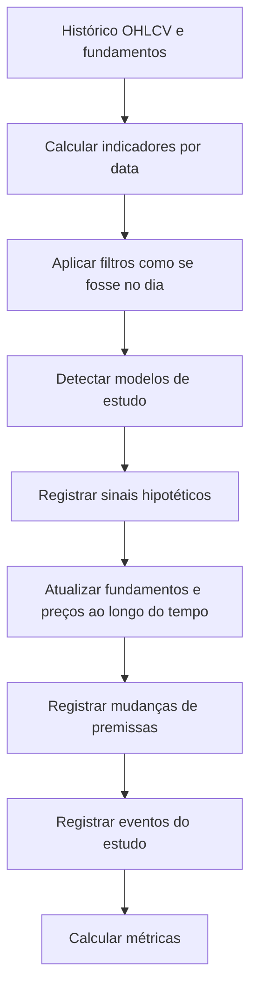

# Backtest e métricas

## Objetivo do backtest

Backtest é o processo de testar uma regra usando dados históricos. Em acompanhamento educacional de ativos, ele responde: "como essa regra teria se comportado no passado, quais sinais gerou e quais riscos apareceram?"

Backtest não garante resultado futuro, mas ajuda a evitar regras frágeis, valuation mal calibrado e excesso de troca de sinais.

## Cuidados obrigatórios

- Não usar dados futuros para tomar uma decisão passada.
- Considerar liquidez.
- Considerar custos em fase futura.
- Documentar se os preços são ajustados por proventos.
- Incorporar dividendos/JCP quando possível.
- Simular sinais hipotéticos sem transformar o resultado em instrução.
- Rodar o teste em períodos variados de mercado.
- Comparar contra benchmark, como IBOV ou outro índice definido.
- Evitar survivorship bias, testando universo histórico quando a base permitir.

## Fluxo de backtest

## Métricas obrigatórias

| Métrica                    | Explicação simples                            |
| -------------------------- | --------------------------------------------- |
| Retorno total              | Retorno acumulado no período.                 |
| CAGR                       | Retorno anual composto.                       |
| Maximum drawdown           | Maior queda acumulada do capital no teste.    |
| Volatilidade               | Oscilação dos retornos.                       |
| Retorno ajustado por risco | Relação entre retorno e risco assumido.       |
| Dividendos recebidos       | Soma de dividendos/JCP simulados.             |
| Dividend yield histórico   | Proventos simulados em relação ao preço histórico. |
| Tempo médio em posição     | Quanto tempo a modelo de estudo fica aberta.              |
| Frequência de sinais       | Quantidade de eventos gerados pela regra.     |
| Melhor/pior ativo          | Maiores variações históricas por ativo.       |
| Comparação com benchmark   | Diferença contra IBOV ou referência definida. |

## Saídas possíveis de uma posição simulada

- Reavaliada por preço.
- Reavaliada por fundamento.
- Encerrada por invalidação da modelo de estudo.
- Fim da amostra histórica.

## Relatório mínimo

Cada backtest deve registrar:

- modelo de estudo testada;
- versão da regra;
- período testado;
- universo de ativos;
- fonte dos dados;
- parâmetros de valuation;
- métricas consolidadas;
- lista de eventos hipotéticos;
- dividendos considerados;
- benchmark usado;
- observações de qualidade de dados.
