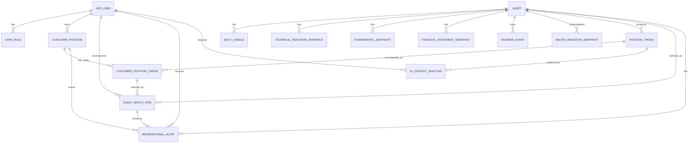

# Modelo de dados

## Visão conceitual

## Princípios

- O modelo não possui enum, tabela ou campo que represente compra, venda, manutenção, aumento, redução, alocação ou encerramento de posição.
- Dados declarados de posição real são informativos e auditáveis; não servem para gerar conduta.
- Alertas informativos são eventos factuais com fonte, data de referência, evidência e versão de regra.
- Dados incompletos, ilíquidos, desatualizados ou inconsistentes bloqueiam modelo de estudo e alerta informativo.

## Usuários

### `app_users`

Representa usuários cadastrados na plataforma.

Campos principais:

- `id`
- `name`
- `email`
- `password_hash`
- `status`
- `subscription_status`
- `subscription_plan`
- `subscription_started_at`
- `subscription_expires_at`
- `terms_version_accepted`
- `terms_accepted_at`
- `created_at`
- `updated_at`
- `last_login_at`

Regras:

- e-mail deve ser único;
- senha deve ser armazenada somente como hash;
- usuário bloqueado não pode autenticar;
- usuário `CUSTOMER` precisa ter assinatura/acesso válido;
- criação de usuário é administrativa e restrita ao perfil `ADMIN`.

### `user_roles`

Perfis:

- `CUSTOMER`: usuário assinante da plataforma.
- `ADMIN`: usuário administrativo com acesso a configurações gerais, cadastro de usuários e ativos.

## Universo monitorado

### `assets`

Representa ativos monitorados.

Campos principais:

- `id`
- `symbol`
- `name`
- `sector`
- `industry`
- `market`
- `asset_type`
- `active`
- `monitoring_reason`
- `data_collection_initialized`
- `created_at`
- `updated_at`

Somente ativos cadastrados e ativos devem ser consultados em fontes externas.

## Dados de mercado e fundamentos

### `daily_candles`

Guarda candles diários normalizados por ativo, data e fonte.

Campos principais:

- `asset_id`
- `trade_date`
- `open_price`
- `high_price`
- `low_price`
- `close_price`
- `adjusted_close_price`
- `volume_quantity`
- `volume_financial`
- `source`
- `quality_status`
- `collected_at`

### `technical_indicator_snapshots`

Guarda indicadores técnicos de longo prazo derivados dos candles.

Campos principais:

- `asset_id`
- `trade_date`
- `sma50`, `sma100`, `sma200`
- `ema50`, `ema100`, `ema200`
- `return6m`, `return12m`
- `avg_volume_60`
- `historical_volatility`
- `recent_drawdown`
- `trend_status`
- `calculation_version`

### `fundamental_snapshots`

Guarda fundamentos normalizados e indicadores derivados.

Campos principais:

- `asset_id`
- `reference_date`
- `most_recent_quarter`
- `period_type`
- `source`
- `quality_status`
- múltiplos, margens, endividamento, caixa, crescimento, dividendos e premissas auditáveis.

Regra de frescor:

- `most_recent_quarter` deve representar o período contábil mais recente;
- se o próximo demonstrativo esperado vencer a tolerância operacional, o ativo deve ser bloqueado por qualidade.

### `financial_statement_snapshots`

Guarda demonstrativos financeiros brutos ou normalizados.

Campos principais:

- `asset_id`
- `statement_type`
- `period_type`
- `end_date`
- `source`
- `quality_status`
- `payload_json`

### `dividend_events`

Guarda eventos de dividendos, JCP e eventos correlatos.

Campos principais:

- `asset_id`
- `event_type`
- `last_date_prior`
- `payment_date`
- `approved_on`
- `rate`
- `factor`
- `label`
- `source`

### `macro_indicator_snapshots`

Guarda séries macroeconômicas usadas como contexto.

Campos principais:

- `slug`
- `name`
- `reference_date`
- `value`
- `unit`
- `frequency`
- `source`

## Modelos de estudo

### `position_theses`

Guarda modelos de estudo educacionais por ativo, data, tipo e versão de regra.

Campos principais:

- `id`
- `asset_id`
- `reference_date`
- `thesis_type`
- `status`
- `score`
- `score_breakdown_json`
- `reasons_json`
- `failed_filters_json`
- `price_ceiling`
- `fair_price_estimate`
- `safety_margin_percent`
- `review_points_json`
- `rule_version`
- `created_at`

Regras:

- status permitidos são neutros: `DADOS_INSUFICIENTES`, `EM_ESTUDO`, `CRITERIOS_ATENDIDOS`, `CRITERIOS_PARCIALMENTE_ATENDIDOS`, `CRITERIOS_EM_ATENCAO`, `DADOS_DESATUALIZADOS`;
- o score mede aderência a critérios, não qualidade de investimento;
- filtros e razões devem ser auditáveis;
- modelo bloqueado por qualidade não deve gerar alerta informativo sem evidência suficiente.

### `asset_screening_results`

Guarda o resultado consolidado de filtros por ativo e data.

Campos principais:

- `asset_id`
- `reference_date`
- `status`
- `failed_filters_json`
- `rule_version`

## Posições e acompanhamentos

### `customer_positions`

Representa cadastro informativo de posição real declarado pelo usuário.

Campos principais:

- `user_id`
- `asset_id`
- `quantity`
- `average_price`
- `entry_date`
- `user_lower_price_threshold`
- `user_upper_price_threshold`
- `target_return_percent`
- `notes`
- `status`
- `created_at`
- `updated_at`
- `closed_at`

Regras:

- posição aberta deve ter quantidade e preço médio positivos;
- limiares são definidos pelo usuário para acompanhamento informativo;
- aporte declarado pelo usuário recalcula preço médio ponderado;
- redução declarada pelo usuário preserva preço médio e altera somente quantidade;
- posição fechada preserva histórico;
- nenhuma regra pode converter posição declarada em orientação de conduta.

### `customer_position_theses`

Representa associação de uma posição a um modelo de estudo acompanhado.

Campos principais:

- `user_id`
- `position_id`
- `asset_id`
- `accepted_thesis_id`
- `thesis_type`
- `status`
- `accepted_at`
- `accepted_score`
- `accepted_price`
- `accepted_price_ceiling`
- `accepted_safety_margin_percent`
- `rule_version`
- `notes`
- `closed_at`
- `exit_reason`

Regras:

- a posição deve pertencer ao usuário autenticado;
- o modelo acompanhado deve ser do mesmo ativo;
- deve existir no máximo um vínculo ativo por posição;
- trocar o modelo acompanhado encerra o vínculo anterior e preserva histórico.

### `asset_watch_items`

Representa acompanhamento informativo de ativo pelo usuário.

Campos principais:

- `user_id`
- `asset_id`
- `source_position_id`
- `accompanied_study_model_id`
- `status`
- `user_lower_price_threshold`
- `user_upper_price_threshold`
- `notes`
- `created_at`
- `updated_at`
- `archived_at`

Regras:

- status permitidos: `ACTIVE`, `PAUSED`, `ARCHIVED`;
- deve existir no máximo um acompanhamento ativo por usuário e ativo;
- limiares são informativos e não orientam execução.

## Alertas e e-mails

### `informational_alerts`

Representa alerta factual de preço, dado, indicador, premissa ou qualidade.

Campos principais:

- `user_id`
- `asset_id`
- `watch_item_id`
- `source_position_id`
- `study_model_id`
- `current_study_model_snapshot_id`
- `reference_date`
- `event_type`
- `severity`
- `title`
- `summary`
- `evidence_json`
- `source`
- `notification_channel`
- `notification_status`
- `notification_provider`
- `notification_provider_message_id`
- `notification_attempt_count`
- `notification_last_error`
- `notification_sent_at`
- `rule_version`
- `created_at`
- `read_at`

Eventos permitidos:

- `PRICE_THRESHOLD_REACHED`
- `DATA_UPDATED`
- `DATA_STALE`
- `INDICATOR_THRESHOLD_REACHED`
- `STUDY_ASSUMPTION_CHANGED`
- `QUALITY_DATA_BLOCKED`

Regras:

- alerta deve ser idempotente por usuário, ativo, origem, data, tipo, fonte e versão de regra;
- evidências devem preservar fonte, regra, data de referência e dados de auditoria;
- evidências de `STUDY_ASSUMPTION_CHANGED` devem preservar, quando disponíveis, status atual do estudo, score aceito, score atual, variação de score e filtros/motivos determinísticos usados para explicar o alerta;
- envio de e-mail não deve duplicar alerta;
- leitura web usa `read_at` e não altera o estado de envio do provider.

## IA

### `ai_context_analyses`

Guarda contexto econômico enriquecido por IA para um modelo de estudo.

Campos principais:

- `thesis_id`
- `asset_id`
- `reference_date`
- `requested_by_user_id`
- `provider`
- `model`
- `prompt_version`
- `prompt_hash`
- `input_hash`
- `input_summary_json`
- `output_json`
- `sources_json`
- `validation_status`
- `processing_status`
- `latency_ms`
- `error_message`
- `created_at`
- `started_at`
- `finished_at`

Regras:

- pacote de entrada não deve conter recomendação, conduta ou segredos;
- resposta sem fonte externa auditável deve ser inválida;
- resposta que oriente compra, venda, manutenção, aumento, redução, alocação ou encerramento deve ser inválida;
- IA não altera modelos de estudo, alertas ou decisões determinísticas.

## Operação

### `data_collection_records`

Audita chamadas a fontes externas.

Campos principais:

- `category`
- `provider`
- `endpoint`
- `reference_date`
- `status`
- `error_code`
- `error_message`
- `requested_at`
- `completed_at`
- `took_millis`

### `job_runs`

Audita execuções agendadas e manuais.

Campos principais:

- `job_name`
- `reference_date`
- `trigger_type`
- `triggered_by_user_id`
- `status`
- `started_at`
- `completed_at`
- `error_message`
- `parameters_json`

Regras:

- falha crítica em coleta deve impedir modelos de estudo, screener, alertas e e-mails baseados em dados antigos;
- cada execução deve ser rastreável por data, job, status, parâmetros e erro.
